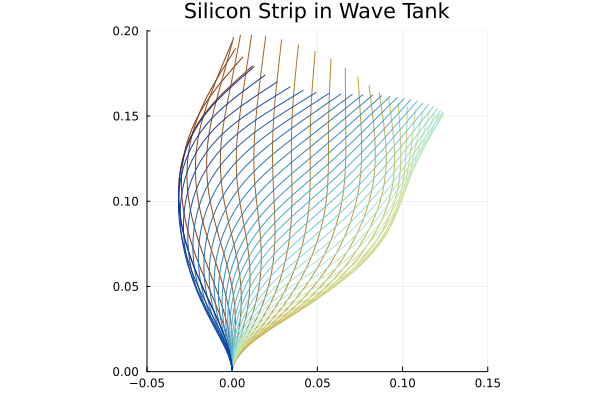

# EABM.jl: The Elastically-Articulated Body Method for Modelling Fluid-Filament Interaction
|  | 
|:--:| 
| *A complexly branched plant oscillates under 3D wave-current flow.* |
### Purpose
This is a structural dynamics library for Julia. It can be used to **simulate 3D, tree-toplogy assemblies of slender structures, under the loads of a submerging fluid**. Particularly, its use is expected for simulating the dynamics of complex (branching) aquatic plants, but it has been developed with sufficient generality that it can be used in other applications. The backbone of the EABM is Roy Featherstone's *Articulated Body Algorithm*, which is sufficiently extensible such that it may take little work to introduce new forces (even beyond fluid-driven ones), closed topologies (allowing trusses, etc), or alternate boundary conditions. Anecdotally; we have also been able to use it to model a wind turbine, and the seta structure of a gecko's foot adhering electro-statically with a wall.
### Journal Paper
This codebase is an open source version of the one used in a paper, which is currently under review, for the *Journal of Fluids and Structures*, coauthored by myself (Rufus Dickinson), Dr. Tim Marjoribanks, Prof. Chris Keylock, and Dr. Alessandro Palmeri, as part of my PhD in Fluid-Structure Interaction at Loughborough University. In that paper, **the EABM is validated in its ability to simulate linear statics and dynamics of beams, flow-induced reconfiguration of heterogeneous and complex plants, and wave-induced dynamics of seagrass**. The test cases for the module correspond to a subset of these validations.
|  | 
|:--:| 
| *A silicon strip's motion inside a wave tank, predicted by the EABM using the virtual fluid articulation model.* |
### Technical Overview
The extension/modification of Featherstone's algorithm to the study of fluid-filament interaction is achieved through 3 principle model components: The definition of **elastic torques driving rotational joints, simulating bending**. The definition of **a suite of fluid forces; buoyancy, drag, friction, virtual buoyancy, and added mass**. Use of eigenvector analysis, iterative methods, and integrators; to respectively predict (simulate) linear dynamics, static responses, and nonlinear dynamics. Amongst some novelties of how the EABM treats these topics, the stand-out is the *virtual fluid articulation* concept, which is a neat introduction of the added mass effect to the framework of the articulated body algorithm.
### Example Usage
Over many versions of the codebase, I have learnt to make its usage quite straight-forward. Below is an example.
```julia
using EABM, Plots;

# Subject properties. All units are SI.
strip_length = 0.2;
width = 0.02; thickness = 0.0019;
density = 670; stiffness = 0.5e6;

# Subject instantiation. RotaryJoint(:y) defines 1DOF joints, so this is a 2D simulation.
discretization_resolution = 20;
body = EABM.FluidborneStrip(strip_length, width, thickness, density, stiffness,
    discretization_resolution, RotaryJoint(:y));

# Fluid properties. Flow should be defined for a 3D field.
fluid_density = 1000;
flow_func = (x, t) -> [0.1, 0, 0];

# Driving scheme. Elasticity is required for structural simulation.
force = force_gravity() + force_buoyancy(fluid_density) + 
    force_drag(fluid_density, flow_func)
torque = torque_elastic();

# Check the lowest two structural eigenfrequencies of the subject.
# Eigenvectors are solved with 
predicted_freqs, modes = frequencies(body);
println("Predicted frequencies =   ", predicted_freqs[end-1:end] );

# Simulate T seconds of movement. Integration is done with DifferentialEquations.jl.
T = 4;
iq = zeros(body);
sol = simulate(body, force, torque, T,
    initcond = iq, integrator = :approx );
println("Simulation over.")

# Show the final state of the simulation with Plots.jl.
default(show=true);
l = @layout([a b]);

p1 = plot(sol, idxs=1:discretization_resolution, xlabel="Time /s", ylabel="Joint Angles / rad", label="");

pos = get_position(body, sol(0));
p2 = plot(pos[1,:], pos[3,:], label="Initial state", aspect_ratio=:equal);
pos = get_position(body, sol(T));
plot!(pos[1,:], pos[3,:], label="Final state", aspect_ratio=:equal);

plot(p1, p2, layout=l);

```

### Installation
For the moment, EABM.jl is not available in the General Registry. To install, follow these steps. Please note that EABM.jl was written in Julia version 1.8.4.

1. Clone this repository, e.g. to a folder called `EABM`.
2. Navigate to `EABM` in your terminal / command prompt.
3. Type the following
    * Press `]`.
    * `add LinearAlgebra, Printf, DifferentialEquations, ForwardDiff`
    * Press backspace.
    * `using EABM`

 One reason this may not work is due to package versioning. This is something that will be fixed when the package is submitted to the General Registry.

 For the tests, you will also need to `add Plots`.
 

 If you're interested in STL imports / exports, you may want to check out , which is supplied as a proof of concept.


### Contact
Please contact Rufus Dickinson via his Loughborough University email, found on his [staff page](https://www.lboro.ac.uk/departments/abce/staff/rufus-dickinson/).

<!---
Stuff from Julia library setup. I may one day submit the EABM to be an official library!
[](https://github.com/Rufnacous/EABM.jl/actions/workflows/CI.yml?query=branch%3Amaster)
-->
